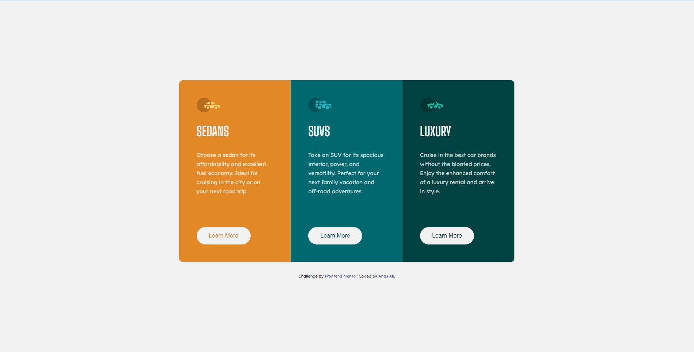

# Frontend Mentor - 3-column preview card component solution

This is a solution to the [3-column preview card component challenge on Frontend Mentor](https://www.frontendmentor.io/challenges/3column-preview-card-component-pH92eAR2-). Frontend Mentor challenges help you improve your coding skills by building realistic projects. 

## Table of contents

- [Overview](#overview)
  - [The challenge](#the-challenge)
  - [Screenshot](#screenshot)
  - [Links](#links)
- [My process](#my-process)
  - [Built with](#built-with)
- [Author](#author)
- [Acknowledgments](#acknowledgments)

## Overview
I took this challenge to improve my skills using flexbox and css syntax of sass, for the first time I actually finished the challenge faster than I thought which was so gratifying. ^_^
### The challenge

Users should be able to:

- View the optimal layout depending on their device's screen size
- See hover states for interactive elements

other than the hover states I added an active state which gets activated when the button gets clicked.

### Screenshot

### Links

- Solution URL: [solution URL here](https://github.com/anas-cd/3-column-preview-card-component)
- Live Site URL: [live site URL here](https://anas-cd.github.io/3-column-preview-card-component/)

## My process

### Built with

- Semantic HTML5 markup (as mush as I can at least)
- CSS custom properties
- Flexbox
- Desktop-first workflow
- SASS (scss syntax)
- gulp for sass compiling
- scss css variables  

### What I learned

coding is even more exciting than I thought

## Author

- Website (still working on it) - [Anas Ali](https://anas-cd.github.io/)
- Frontend Mentor - [@anas-cd](https://www.frontendmentor.io/profile/anas-cd)
- Twitter - [@AnasCd](https://www.twitter.com/AnasCd)

## Acknowledgments
I used a really helpfull and simple boilerplate made by "coder-coder" for frontend development, here is the repo for it : 

- coder-coder - [biolerplate](https://github.com/thecodercoder/frontend-boilerplate)

